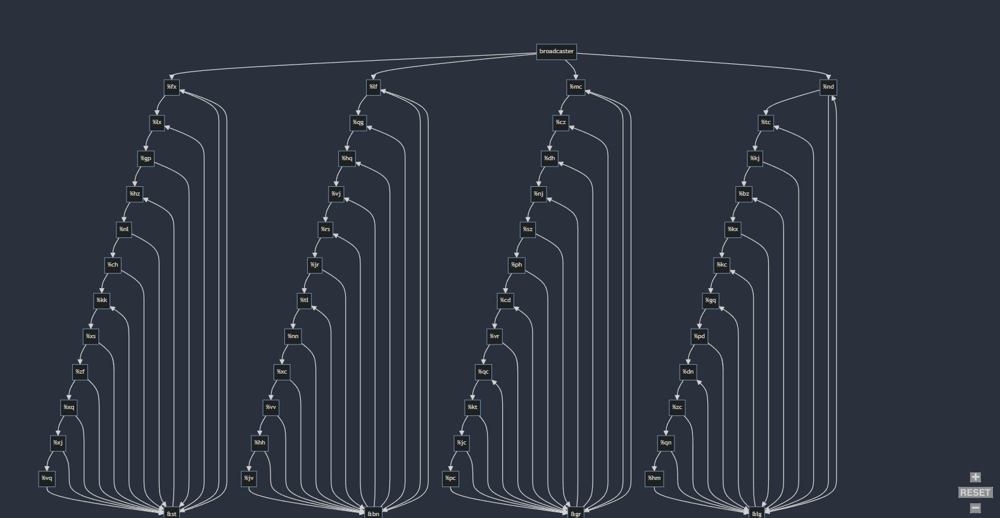

# Day 20: [Pulse Propagation](https://adventofcode.com/2023/day/20)

### Question Summary
- **Part 1** - Follow instructions for different electronic gates to propagate values through them until they all settle down. Repeat this 1000 times and get how many low and high pulses were sent. 
- **Part 2** - There's a gate called 'rx'. Find out when it will turn on.

### Solution summary 

Part 1 is straightforward though tedious. Use queue to get list of signals to propagate and lists to keep track of states, etc. 

For part 2, we need to visualise the input as shown below:
The gate `rx` receives signal from only gate `hb` which is a conjunction gate that receives signals from 4 different conjunction gates. Thus `hb` is like an inverter and will send a low signal to `rx` when it receives a high signal from the 4 conjunction gates above it. 

As can be seen, there are 12 flip-flop gates before these 4 conjunction gates. 2^12 = 4096, so we press the button 4096 times and see at what iterations did the 4 conjunction gates turn on. Once we have these 4 numbers, we take their LCM which is the answer, the first time when all 4 turn on simultaneously. 

