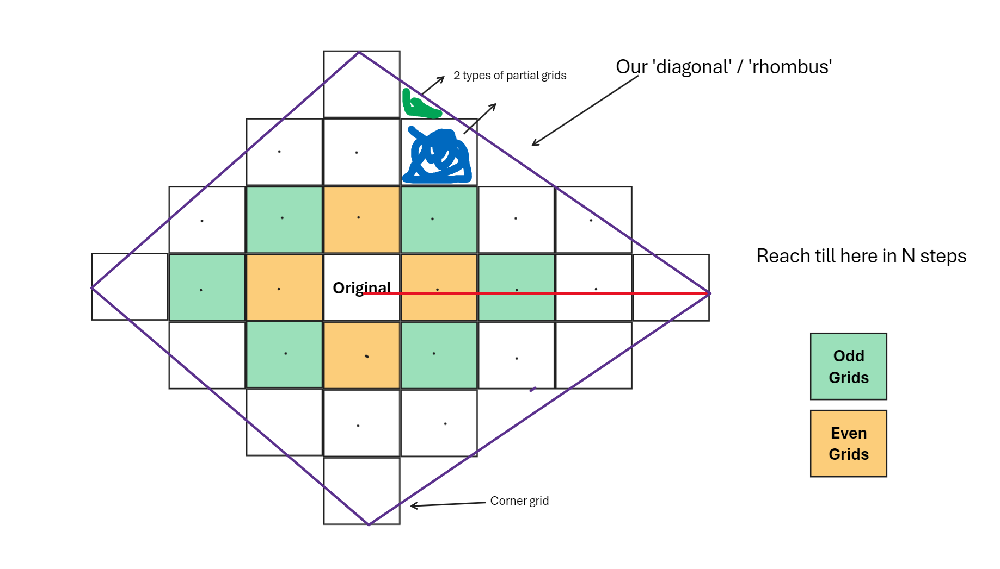

# Day 21: [Step Counter](https://adventofcode.com/2023/day/21)

### Question Summary
- **Part 1** - Grid with rocks. Start at middle, find points that can be reached in 64 steps
- **Part 2** - Grid expands infinitely in all directions, how many points can be reached in 2,650,1365 steps. 

### Solution summary 

See comments in solution and below diagram:

